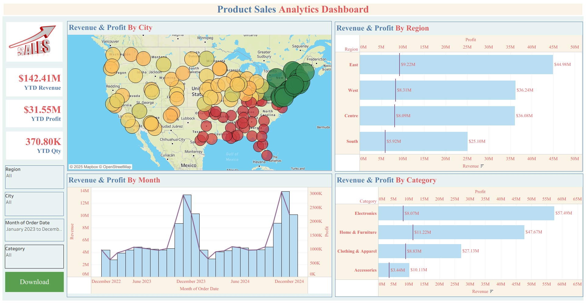
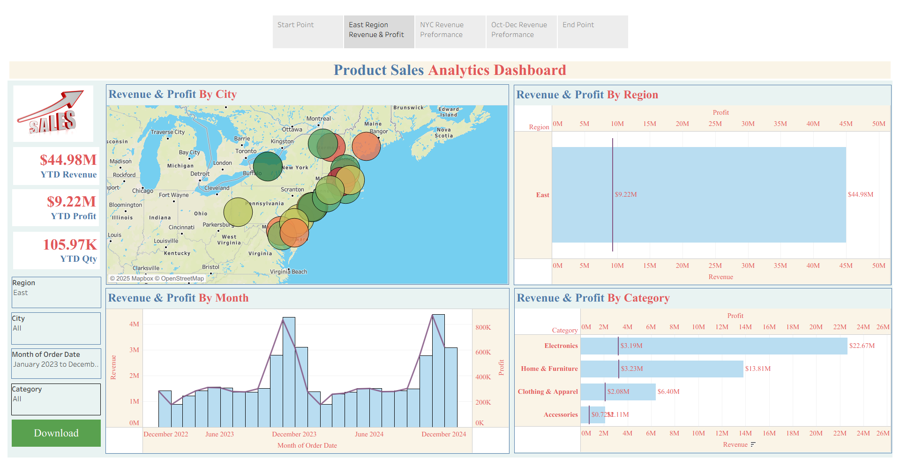
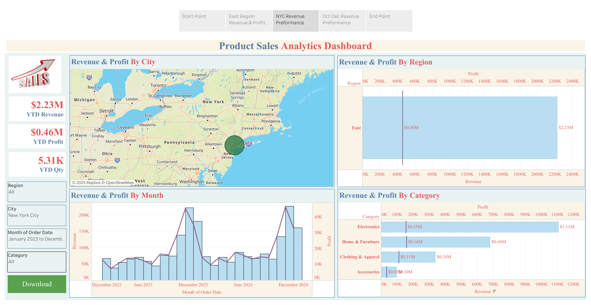
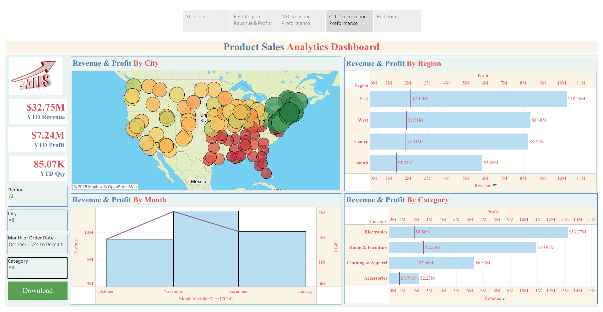

# 💡 Tableau Project by Yash Yennewar

# **Product Sales Analytics Dashboard**
Interactive Tableau dashboards analyzing US product sales with insights on revenue, profit, and category trends across regions and cities.

## 📂 Project Link
<a href ="https://public.tableau.com/views/Product_Sales_Analysis_17582747822850/DataStory?:language=en-US&:sid=&:redirect=auth&:display_count=n&:origin=viz_share_link">Product Sales Analytics</a>

---

## 📌 Overview
This project presents an **interactive Tableau dashboard** analyzing **US Product Sales data** across different dimensions such as **Region, City, Category, and Time**.

The goal of this analysis is to provide executives with actionable insights on **Revenue performance, profitability and regional growth patterns**.  

The dashboard helps in answering:
- How do revenue and profit trends behave over time and across different regions?
- Which product categories and sub-categories drive performance?
- Which regions has the most revenue and profit?
- Which products are a source of profit loss despite strong revenue? 

---

## 📂 Project Files
- `Product_Sales_Analysis.twbx` → Tableau packaged workbook (open in Tableau Desktop/Public).  
- `Dashboard.png` → Main Executive Dashboard (overview).  
- `DataStory-1.png`, `DataStory-2.png`, `DataStory-3.png` → Story points highlighting **East region success, NYC performance, and October - December peak revenue**.  

---

## 📊 Key Metrics (KPIs)
1. **YTD Revenue** – Total revenue year-to-date.  
2. **YTD Profit** – Net profit across all orders.  
3. **YTD Quantity** – Units sold year-to-date.  
4. **Revenue & Profit by City** – Geographic profitability analysis.  
5. **Revenue & Profit by Month** – Seasonality and monthly trends.  
6. **Revenue & Profit by Category & Sub-Category** – Product-driven analysis.  
7. **High/Low Performing Cities** – Spotting profitable and loss-making cities.  
8. **Regional Contribution to Overall Sales** – Identifying key growth markets.

---

## 📈 Dashboard Insights
### 🔹 1. Executive Dashboard
- **Overall Performance**:
  - $142.41M YTD Revenue.
  - $31.55M YTD Profit.
  - 370.80K YTD Quantity.
- **Regional Performance**:  
  - East region achieved highest revenue and profit.  
  - West & Central regions are underperforming.  
  - South is slightly below expectations.  
- **Top Cities** : Burlington and Manchester cities perform strongly.  
- **Category Analysis** : Laptops, Bedding, and Sportsware dominate revenue sales.  

### 🔹 2. Data Story Highlights
- **East Region Success** → East outperformed other regions with positive revenue & profit contribution. 
- **NYC performance** → New York City stands out with consistent growth and profitability.  
- **October - December Peak Revenue** → October - December 2024 marked the **highest monthly revenue**, driven by strong promotions and seasonal demand.  

---

## 📷 Visualizations
- **Dashboard View**  
    

- **Data Story 1 – East Region**  
    

- **Data Story 2 – NYC Performer**  
    

- **Data Story 3 – October - December Peak Revenue**  
    

---

## 🛠️ Tools & Technologies
- **Tableau Desktop / Tableau Public** – Data visualization and storytelling.  
- **Product Sales Dataset** – Sample product sales dataset (product, region, customer, order details).  

---

## 🚀 How to Use
1. Clone or download this repository.  
2. Open the file `Product_Sales_Analysis.twbx` in Tableau Desktop or Tableau Public.  
3. Interact with filters (Region, City, Category, Time) to explore insights.  

---

## 📌 Future Improvements
- Add **forecasting models** for sales prediction.  
- Include **customer segmentation** analysis.  
- Build **profitability heatmaps** at state/city level.  

---

## 📜 License
This project is for **educational and portfolio purposes** only. The dataset used is the **Tableau Product Sales Sample Dataset**.

